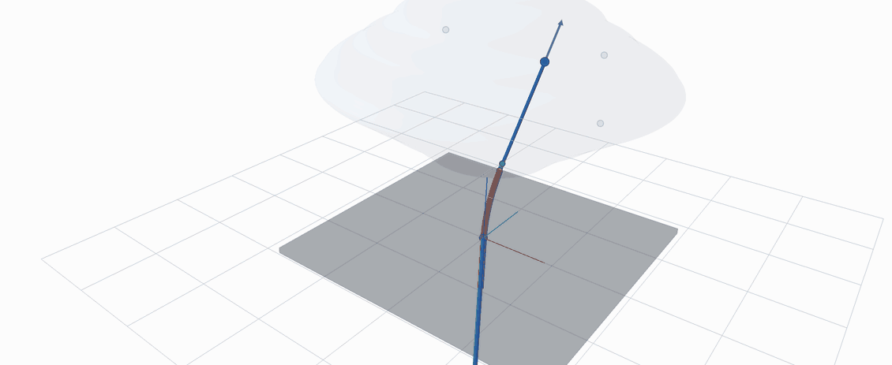
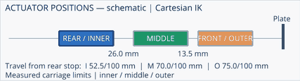

# Concentric-Tube Robot: design, simulation and kinematic evaluation

An interactive three-tube robot simulator and research companion to **Design, Simulation and Kinematic Evaluation of an Open-Source Concentric-Tube Robot Platform**, by **David Tze Hin Ma**, Queen Mary University of London, MSc Extended Research Project, September 2026. Supervisor: **Dr S. M. Hadi Sadati**.

The project developed a three-carriage CTR platform and investigated how tube geometry changes its predicted reach and positional dexterity under measured actuator limits. After a laboratory fire prevented access to the assembled robot, the final evaluation used an ideal numerical model. This repository brings together the interactive simulation, sampling and optimisation code, saved results and figures. The [CAD and bill of materials section](hardware/README.md) is reserved for the assembly package to follow.

**Start here:** [Run and control the simulator](docs/SIMULATION.md) · [Sampling and optimisation](research/README.md) · [Results gallery](docs/dissertation/README.md) · [File guide](docs/FILE_GUIDE.md)

## Interactive 3D simulation



*The animation from the final presentation shows scripted motion of the proposed tubes and an approximate sampled workspace. Run the application below to control the robot yourself.*



The desktop simulator supports joint translation and rotation, Cartesian endpoint targets, inverse-kinematics previews, independent or coordinated carriage movement, and keyboard, mouse or PS5 controller input. Both configurations use the measured 100 mm actuator strokes and coupled carriage clearances. **F7 switches original/proposed tubes** and resets the pose.

### Install and launch

Use Python 3.11 or newer and a desktop with OpenGL support. Download this repository, open a terminal in its folder, and run:

```bash
python -m venv .venv
```

Activate it on **macOS/Linux**:

```bash
source .venv/bin/activate
```

Or on **Windows PowerShell**:

```powershell
.venv\Scripts\Activate.ps1
```

Then install the dependencies and choose a configuration:

```bash
python -m pip install -r requirements.txt
python launch_simulation.py --configuration original
python launch_simulation.py --configuration proposed
```

If your system names Python `python3`, use that for the first command. The first launch builds a workspace cache and can take longer. A controller is optional.

| Action | Keyboard / mouse |
| --- | --- |
| Select inner / middle / outer tube | 1 / 2 / 3 |
| Translate / rotate selected tube | W/S / A/D |
| Switch joint / Cartesian control | Tab |
| Choose target axis and adjust it | X/Y/Z, then Left/Right |
| Calculate a target preview, then execute | Enter, then Enter again |
| Switch independent / coordinated carriages | C |
| Compare original / proposed tubes | F7 |
| Orbit / zoom | Drag / mouse wheel |
| Reset / close | R / Q |

See the [full controls and troubleshooting guide](docs/SIMULATION.md).

### Original and proposed tube configurations

All arrays use **inner / middle / outer** order. Material lengths run from chuck front to distal tip; they are not straight-line endpoint distances.

| Parameter | Original | Proposed, candidate t027 |
| --- | --- | --- |
| Total lengths (mm) | 350 / 170 / 80 | 350 / 177.5 / 87.5 |
| Curved lengths (mm) | 0 / 90 / 65 | 0 / 90 / 65 |
| Precurvature (m⁻¹) | 0 / 19.12 / 14.04 | 0 / 21.37 / 14.04 |


The proposed design is a **selected numerical trade-off**, not a universally better design or a fabrication specification. The software's internal label `optimised` refers to t027 in the main viewer; an earlier search candidate is retained separately for research provenance.

## Sampling and optimisation

The sampling code generates feasible tube deployments and rotations within the measured carriage limits, predicts their positions with the section-aware forward model, and estimates occupied workspace and positional isotropy. The optimisation studies screen tube lengths, curved lengths and precurvatures, prioritise fixed-start reaching gains in weak regions and a forward corridor, then test frozen candidates on independent target and path banks. A separate dense study compares the original tubes with t027 using 262,144 feasible states per design and 59,341 shared targets. The code, seeds, saved outcomes and failed acceptance checks are retained so the reported trade-offs can be inspected and reproduced.

[Study commands and data downloads](research/README.md) · [Detailed geometry-search methodology](docs/tube_configuration_methodology.md) · [Every code file explained](docs/FILE_GUIDE.md)


| Reported numerical comparison | Original | Proposed |
| --- | ---: | ---: |
| Sampled occupied workspace (cm³) | 2396.25 | 2582.78 |
| Fixed-start IK success within 0.5 mm | 62.28% | 66.99% |
| Forward-corridor mean cell-median isotropy | 0.17757 | 0.20871 |
| Completed held-out paths | 44 / 48 | 43 / 48 |

The workspace estimate increased **7.78%**, fixed-start success increased **4.71 percentage points**, and corridor isotropy increased **17.53%**. Some original workspace was lost and one fewer path completed; **t027 failed the combined held-out acceptance rule**. The path evaluation is separate from the dense target comparison. See the [complete figure gallery and saved results](docs/dissertation/README.md), including the unsuccessful paths and later diagnostic recovery.

## CAD, assembly and bill of materials

[Open the hardware section](hardware/README.md). Individual STL parts, CAD assembly views, rotating and actuator-motion animations, full-robot and single-carriage exploded views, and a checked bill of materials will be added when the final assembly information is supplied. This section is currently pending; part counts have not been guessed.

## Repository guide

| Location | Purpose |
| --- | --- |
| `launch_simulation.py` | Simple launcher for the final-report original/proposed comparison |
| `proposed_tradeoff_simulator/` | Main desktop simulator; original and t027 profiles |
| `measured_hardware_simulator/` | Measured-hardware model and earlier candidate retained by the research pipeline |
| `tools/` | Sampling, search, evaluation and plotting programs |
| `research/` | Reproduction guide, download manifest, verification and results checks |
| `output/` | Frozen small study records and source snapshots; larger arrays come from release downloads |
| `docs/dissertation/` | Final-report figures, short explanations and numerical summaries |
| `docs/media/` | Original animations extracted from the presentation |
| `hardware/` | Reserved assembly, STL and bill of materials section |
| `tests/`, `config/`, root numerical modules | Model checks, historical protocols and shared dependencies |
| `legacy/`, `docs/archive/` | Earlier development material, clearly separated from the main launch route |

The [file guide](docs/FILE_GUIDE.md) explains the individual programs. Temporary files, local environments, editor settings and report drafts are not part of the release.

## Model scope and credits

These are predictions of an ideal unloaded model. Full physical commissioning and independent tip-position validation were not completed. Friction, torsion, contact, elastic stability, anatomical collisions and manufacturing effects are not fully represented; the sampled envelope is not proof that every enclosed target is reachable. Installation and curvature-unit assumptions remain provisional, as described in the report.

The forward-model implementation was supplied by **Dr S. M. Hadi Sadati** and subsequently adapted for section-aware geometry, simulation and evaluation. David Tze Hin Ma led the project and completed the CAD work. AI assistance with software development and numerical analysis is disclosed in the dissertation. See [credits and reuse information](NOTICE.md).
