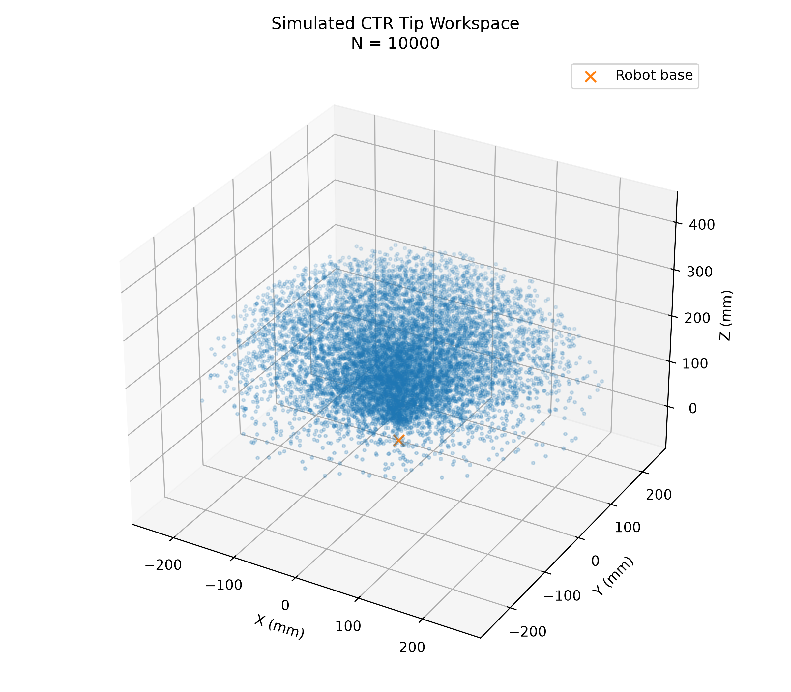

# CTR Simulation

Interactive concentric-tube robot simulation with PS5 controller, keyboard,
and mouse control. The active viewer uses VisPy for responsive rendering.



## Run the simulator

Create the project environment and install its dependencies:

```bash
python3 -m venv .venv
./.venv/bin/pip install -r requirements.txt
```

Start the current viewer:

```bash
./.venv/bin/python interactive_ctr_vispy.py
```

The full controller and keyboard key is displayed in the viewer sidebar.

## Project layout

- `interactive_ctr_vispy.py` — current interactive application
- `CTR_superPosKin_fun_sectioned.py` — section-aware forward kinematics
- `tube_parameters.py` — tube geometry and material parameters
- `tests/` — current model checks
- `tools/` — controller diagnostics and workspace generation
- `assets/cad/` — CAD assets prepared for the digital-twin stage
- `config/` — future CAD joint and actuator calibration data
- `docs/images/` — selected documentation images
- `legacy/` — superseded implementation retained for reference

Generated screenshots are written to `exports/`. Workspace datasets and plots
created by the generator are written to `results/`. Both directories are
excluded from Git.

## Validate the current model

```bash
MPLBACKEND=Agg ./.venv/bin/python tests/static_configuration_test_sectioned.py
```

## Generate a workspace

```bash
./.venv/bin/python tools/workspace_generator.py
```

The generator uses 10,000 configurations by default and may take some time.

## CAD integration

See `assets/cad/README.md` for the required assembly layout. Moving components
must remain separate so their linear and rotary transforms can be driven by the
simulator's deployment and rotation values.
