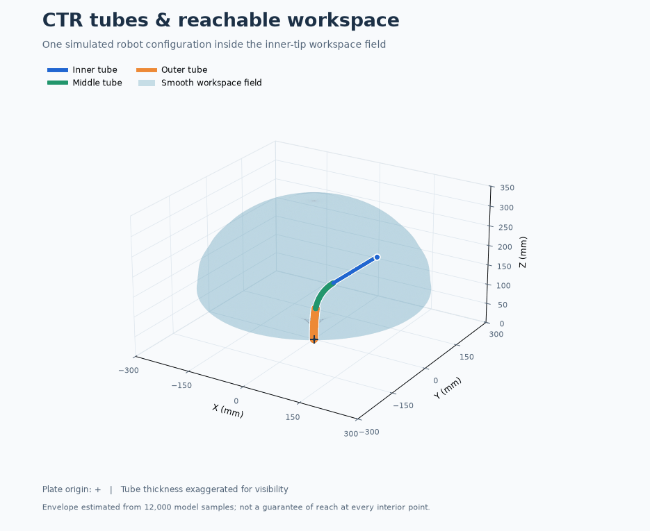

# CTR Simulation

An interactive Python simulator for a three-tube concentric-tube robot (CTR), with real-time 3D visualisation, PS5/keyboard/mouse joint control, constrained Cartesian endpoint control, and reproducible positional workspace and design analysis.

Explore tube deployment and rotation, preview inverse-kinematics solutions and motion routes, and compare the reach of the inner, middle, and outer endpoints.

The animation below rotates around a simulated CTR configuration inside a **smooth, translucent inner-tip workspace field**, estimated from 12,000 sampled positions using the same envelope method as the interactive viewer. Blue, green, and orange identify the visible inner, middle, and outer tube sections; the + marks the plate origin. Tube thickness is exaggerated for visibility. The field illustrates an approximate ideal-model workspace boundary, not experimentally measured reach or a guarantee that every interior point is reachable.



Reproduce the animation and still image with `./.venv/bin/python tools/plot_readme_workspace.py --gif`.
[View the static image](docs/images/ctr_workspace_sectioned.png).
The viewer cache is separate from the independent canonical datasets used for formal analysis.

## Run the simulator

Use **Python 3.11 or newer** (the analysis protocols use the standard-library TOML reader). Create the project environment and install its dependencies:

```bash
python3 -m venv .venv
./.venv/bin/pip install -r requirements.txt
```

Start the current viewer:

```bash
./.venv/bin/python interactive_ctr_vispy.py
```

The full controller and keyboard key is displayed in the viewer sidebar.
The status and parameter interface stays consistent between Joint and Tip mode,
including all three endpoint XYZ positions. Only the Controls section switches
to show the bindings relevant to the active mode.

To try constrained Cartesian tip-position control while keeping the original
joint-control viewer unchanged, run:

```bash
./.venv/bin/python interactive_ctr_tip_control.py
```

In this version, L3 or Tab switches between joint and tip-control modes. In tip
mode, L1/R1 cycle the controlled inner, middle, or outer endpoint. The left
stick moves its red target in global X/Y, L2/R2 move it backwards/forwards along
the endpoint's current direction, and the D-pad provides fine X/Y movement.
Holding Square changes D-pad Up/Down to fine Z movement and also enables slower
analogue movement. Press Cross once to calculate and preview a solution, then
press Cross again to run the smooth simulated movement. Circle cancels a target
or stops an executing movement. Keyboard users can choose an endpoint with
1/2/3, select X/Y/Z and adjust with Left/Right, use Enter to confirm, and Escape
to cancel. Camera orbit uses the right stick or mouse drag; zoom uses the mouse
wheel. Normal target motion is 40 mm/s; Square reduces it to 5 mm/s for
precision placement.

While a solution preview is displayed, D-pad Up/Down chooses the direct or
three-stage retract/reorient/advance route, and D-pad Left/Right cycles through
meaningfully different IK configurations for the same target. Alternative tube
shapes appear as translucent ghosts. Keyboard users can press M for the route
and Left/Right for the solution. The retract route brings all exposed lengths to
zero, changes the rotations at the plate origin, and advances to the confirmed
IK configuration.

Endpoints remain FREE after reaching a target. In tip mode, tap Options to cycle
the selected endpoint through FREE, SOFT LOCK, and HARD LOCK; hold Options to
export. Soft locks permit a 5 mm error and hard locks use a 1.5 mm tolerance.
The sidebar reports each constraint and error. Three XYZ endpoint targets create
nine constraints for only six actuator inputs, so an arbitrary three-point
shape is not always exactly achievable. Reset releases all locks.

The viewer uses the plate reference at Z=0. Exposed robot geometry and the
sampled workspace lie mainly at positive Z, while the portions of each tube
parked behind the plate are drawn as straight nested shafts at negative Z. At
full retraction the curved backbone collapses to the origin, but the complete
colour-coded tube lengths remain visible behind the translucent plate.

The preview includes translucent final tube positions. A cyan path represents
direct simultaneous actuator interpolation, while a purple path represents the
retract/reorient/advance sequence. These are simulation aids, not
collision-checked surgical trajectories; the current model does not yet
represent a straight introducer sheath. Anatomy collision checking, sheath
constraints, and scan registration are later integration stages.

The live viewer displays the earlier smooth, translucent 360-degree workspace
boundary. It changes with the selected endpoint because the outer and middle
tubes have smaller workspaces than the inner tube. Every controller and keyboard
target step is constrained to this surface, so the red target cannot leave the
displayed reachable envelope. The boundary and restart maps use 12,000 shared
valid actuator configurations. Press Triangle to hide or show the workspace
together with the orientation guides. When other endpoints are locked, green
points show sampled configurations satisfying their strict tolerances and amber
points show the additional positions available within the relaxed soft-lock
tolerance. A diamond marker identifies the nearest sampled feasible projection
when the red requested target lies away from that conditional region. Local
Jacobian null-space samples supplement the global cache so narrow hard-lock
regions do not disappear solely because the cached map is coarse.

## Run the design study

The analysis tools cover positional workspace, range-normalised Jacobian
isotropy, and numerical IK residuals. The versioned protocols separate independent
canonical samples from display rotations, and numerical solver tolerance from
task-accuracy thresholds.

| Stage | Implementation and current status |
| --- | --- |
| 2 | Method validation: sampling, symmetry, Jacobians, spatial aggregation and IK tolerances. |
| 3 | Baseline evaluation runner and validation gates. |
| 4 | Primary inner-tip workspace/isotropy convergence extension. |
| 4.1 | Primary inner-tip IK spatial-support extension. |
| 5A | Frozen optimisation methodology and evidence preflight; no optimised design result. |

Local archived runs contain completed Stage-4 workspace/isotropy convergence
and Stage-4.1 IK-support evidence. Those generated datasets are excluded from
this repository. The later Stage-5B pilot was interrupted; full optimisation
and independent final design validation are unfinished. The analysis runners
preserve explicit gates and do not automatically authorise a full search.

See [the methodology](docs/design_analysis_methodology.md),
[protocol configuration](config/README.md), and [tool commands](tools/README.md).

The existing command remains available as a **legacy exploratory** workflow.
It predates the Stage-2 calculation layer and therefore remains non-compliant;
its manifest records explicit deviations. Run the small software
verification profile with:

```bash
MPLBACKEND=Agg ./.venv/bin/python tools/run_design_study.py --profile quick
```

Use `--profile standard` only for exploratory development. Do not treat the old
`--profile publication` output as a final protocol-v1 result. Outputs are written to
`results/design_analysis/`, which is deliberately excluded from Git because the
figures and CSV tables are generated artifacts.

Dexterity is defined as the dimensionless positional isotropy
`sigma_min / sigma_max` of a baseline-range-normalised physical 3-by-6
Jacobian. Its input scale is fixed at 350, 170 and 80 mm for deployment and
pi radians for each rotation, so it is comparable across designs; it is not an
actuator-velocity metric. Reported IK error
is the numerical residual of the ideal model when every local solve starts at
zero deployment and zero rotation; it is not experimentally measured robot
error. The numerical stopping tolerance is provisionally 0.01 mm, whereas
0.5 mm is the separate task-accuracy threshold. Full optimisation remains gated by the frozen optimisation protocol and
completion of the pilot and evidence checks. Existing bounds remain exploratory and are not certified manufacturing
limits.

Dexterity figures use occupancy-aware filled voxels, XY cross-sections, and a
radial–Z map. Voxel size and the minimum number of samples required for a median
depend on the selected profile and are recorded in `study_manifest.json`; no
values are interpolated into unsampled cells.

To regenerate only these higher-density baseline figures without rerunning the
sensitivity and optimisation stages, add `--baseline-only`.

See `docs/design_analysis_methodology.md` for the Stage-2 definitions,
reproducibility rules, pilot evidence, legacy-result warning and the checks
required before optimisation.

## Project layout

- `interactive_ctr_vispy.py` — current interactive application
- `interactive_ctr_tip_control.py` — separate inverse-kinematics tip controller
- `ctr_inverse_kinematics.py` — constrained numerical tip-position solver
- `ctr_spatial_analysis.py` — occupied-volume and spatial isotropy aggregation
- `ctr_task_space.py` — frozen baseline task region and stratified IK targets
- `ctr_motion_planner.py` — confirmed target planning and smooth execution path
- `ctr_workspace_map.py` — sampled workspace generation and loading
- `ctr_sampling.py` — versioned canonical analysis sampling and display sweeps
- `analysis_protocol.py` — protocol validation and reproducibility manifests
- `optimization_protocol.py` — frozen optimisation protocol and evidence audit
- `ctr_design_analysis.py` — dexterity, IK-error, sensitivity, and optimisation
- `CTR_superPosKin_fun_sectioned.py` — section-aware forward kinematics
- `tube_parameters.py` — tube geometry and material parameters
- `tests/` — current model checks
- `tools/` — controller diagnostics and workspace generation
- `assets/cad/` — CAD assets prepared for the digital-twin stage
- `config/` — analysis protocol and future CAD/actuator calibration data
- `docs/images/` — selected documentation images
- `legacy/` — superseded implementation retained for reference

Generated screenshots are written to `exports/`. Workspace datasets and plots
created by the generator are written to `results/`. Both directories are
excluded from Git.

## Validate the current model

See [all automated checks](tests/README.md) for the controller, planner, workspace,
analysis and protocol checks. The static geometry check is:

```bash
MPLBACKEND=Agg ./.venv/bin/python tests/static_configuration_test_sectioned.py
```

## Generate a workspace

```bash
./.venv/bin/python tools/workspace_generator.py
```

The generator uses 10,000 configurations by default and may take some time.
The compact sampled map can be regenerated with:

```bash
./.venv/bin/python tools/generate_workspace_map.py
```

Regenerate the optional legacy three-zone diagnostic map with:

```bash
./.venv/bin/python tools/generate_reachability_zones.py
```

Regenerate the endpoint-specific maps used by tip control with:

```bash
./.venv/bin/python tools/generate_endpoint_workspace_maps.py
```

## CAD integration

See `assets/cad/README.md` for the required assembly layout. Moving components
must remain separate so their linear and rotary transforms can be driven by the
simulator's deployment and rotation values.
