# Dissertation results and figures

Matched to the 88-page final report supplied on 18 September 2026, *Design, Simulation and Kinematic Evaluation of an Open-Source Concentric-Tube Robot Platform*. The [manifest](manifest.json) identifies the report by SHA-256 and records every image, page and saved-data source. The full report is not included in this source checkout.

## What the results show

The proposed configuration is **t027**, a numerical point-to-point trade-off. It did **not** pass the combined held-out path-performance rule. The original tubes remain the reference. Later diagnostic candidates are separate studies.

| Dense Chapter 5 comparison | Original | Proposed |
| --- | ---: | ---: |
| Sampled occupied workspace (cm³) | 2396.25 | 2582.78 |
| Fixed-start IK success within 0.5 mm (%) | 62.280 | 66.993 |
| Median numerical residual (mm) | 0.009357 | 0.008577 |
| P95 numerical residual (mm) | 90.355 | 87.277 |
| Mean numerical residual (mm) | 19.832 | 16.829 |
| Maximum numerical residual (mm) | 116.426 | 118.113 |
| Forward-corridor mean cell-median isotropy | 0.17757 | 0.20871 |

Workspace uses 262,144 feasible states per design and 5 mm cells. IK uses the same 59,341 fresh targets, volume weighting, a fixed start and 40-iteration budget; failures remain in the statistics. The workspace gain is 7.78%, IK gain is 4.713 percentage points and corridor isotropy gain is 17.53%. Sampled occupancy loses 30.24 cm³ of original cells while gaining 216.77 cm³ elsewhere. Remaining-region IK success decreases from 53.92% to 53.15%.

[Dense numerical summary](data/summary.json) · [Regional isotropy/support](data/spatial_regions.json) · [Occupancy changes](data/overlay.json) · [Sampling checks](data/sampling_checks.json) · [Dense protocol](data/protocol.json)

## Separate held-out path evaluation

| Two banks of 24 paths | Original | Proposed |
| --- | ---: | ---: |
| Completed paths | 44 / 48 | 43 / 48 |
| Mean of the two bank-level tracking P95 values (mm) | 0.087 | 0.153 |

Completion requires all 81 checked deviations to be at most 0.5 mm. The mean of two P95 values is **not a pooled P95**. These path banks are separate from the dense Chapter 5 target bank. Post-hoc recovery does not replace failed scores.

[Path-bank means](data/path_bank_means.json) · [Acceptance outcome](data/path_outcome.json) · [Frozen proposed candidate](data/frozen_candidate.json)

The frozen-candidate record contains **training/selection** metrics, not the dense or held-out scores above. The path-bank file also retains the separate earlier candidate under `previous`; it is not t027.

## Scope and provenance

All results are numerical predictions of an ideal unloaded model. Full physical commissioning and independent tip-position validation were not completed. Installation lengths, internal guidance and curvature-unit assumptions remain provisional; torsion, friction, stability and anatomical collisions are not fully represented. The forward-model implementation was supplied by Dr S. M. Hadi Sadati; subsequent adaptations, simulation/control and evaluation work are distinguished in the report. Publication of these results does not grant a new licence over supplied code.

The repository includes both measured-hardware viewers, the study code, frozen small result files and analytical checks. Larger raw banks and frozen source snapshots are available with the [research data release](../../research/README.md). CAD and the bill of materials will be added separately.

## Figure gallery

Images below are the embedded images from the supplied PDF, preserving its palettes and labels. Some newer local figure exports differ and have deliberately not been substituted. See [the report map](report_map.csv) for archive and script provenance; archive paths are restored by the research-data downloads.

### Figure 5.1: Spatial distribution of shared IK targets

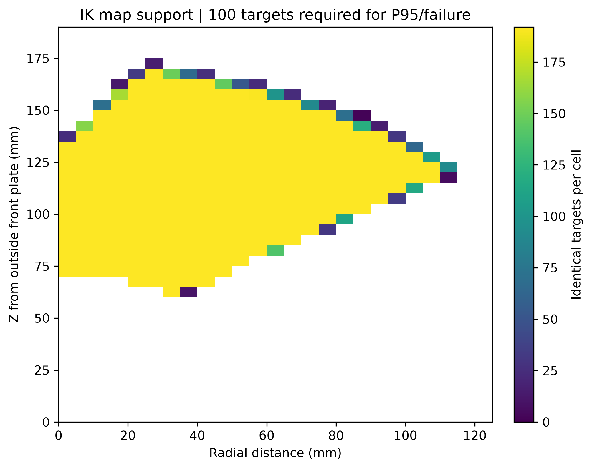

At least 100 targets per supported cell; these cells cover 90.48% of the frozen reference volume. Sparse cells remain masked in P95 and failure maps.

### Figure 5.2: Workspace sampling and cell-size sensitivity

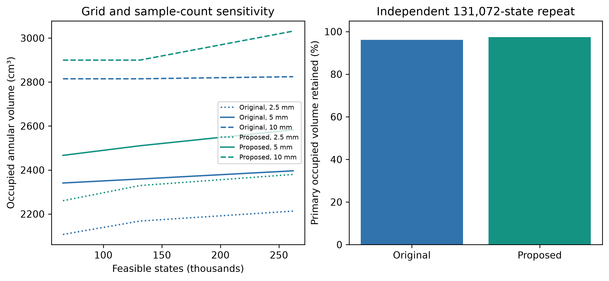

Occupancy depends on sample count and grid size. The independent repeat uses 131,072 feasible states; these checks do not establish exact geometric convergence.

### Figure 5.3: Original and proposed intrinsic tube shapes

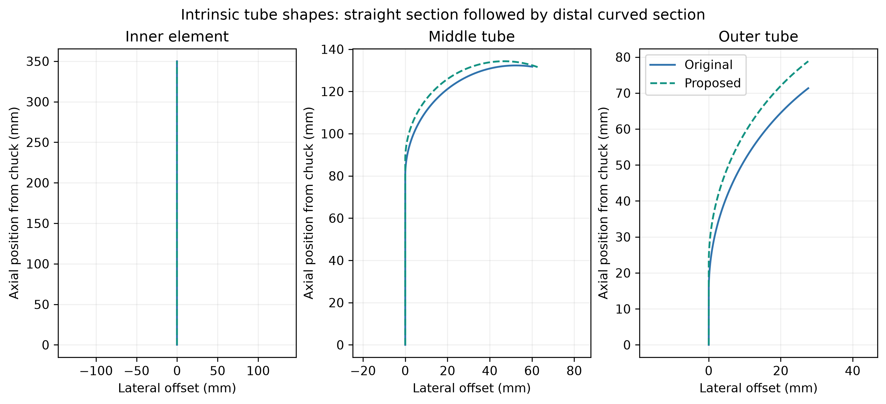

Inner / middle / outer order. Total lengths change from 350 / 170 / 80 to 350 / 177.5 / 87.5 mm. Middle precurvature changes from 19.12 to 21.37 per metre. These are model geometries, not measured shapes.

### Figure 5.4: Proposed-configuration simulation interface

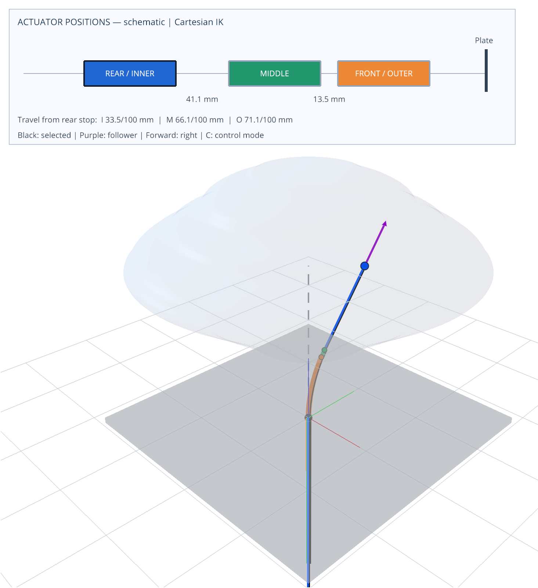

Qualitative viewer envelope from 12,000 feasible states. The existing controller is retained. This display is separate from the dense quantitative study.

### Figure 5.5: Hardware-constrained workspace comparison

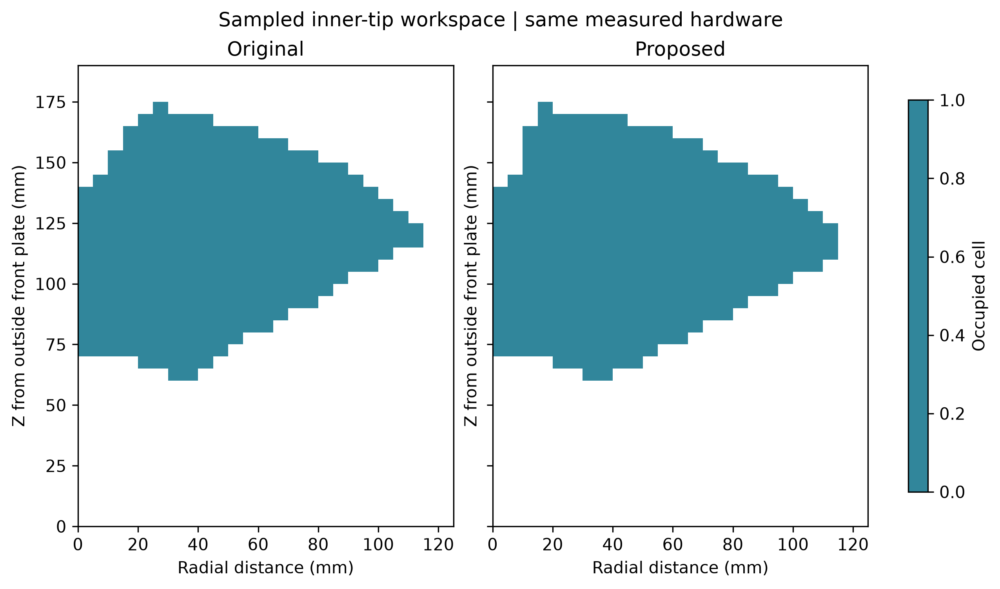

262,144 feasible states per design; 5 mm radial-height cells. Both designs use the same hardware constraints and seed, but accepted configurations differ with the feasible domains.

### Figure 5.6: Shared, gained and lost workspace occupancy

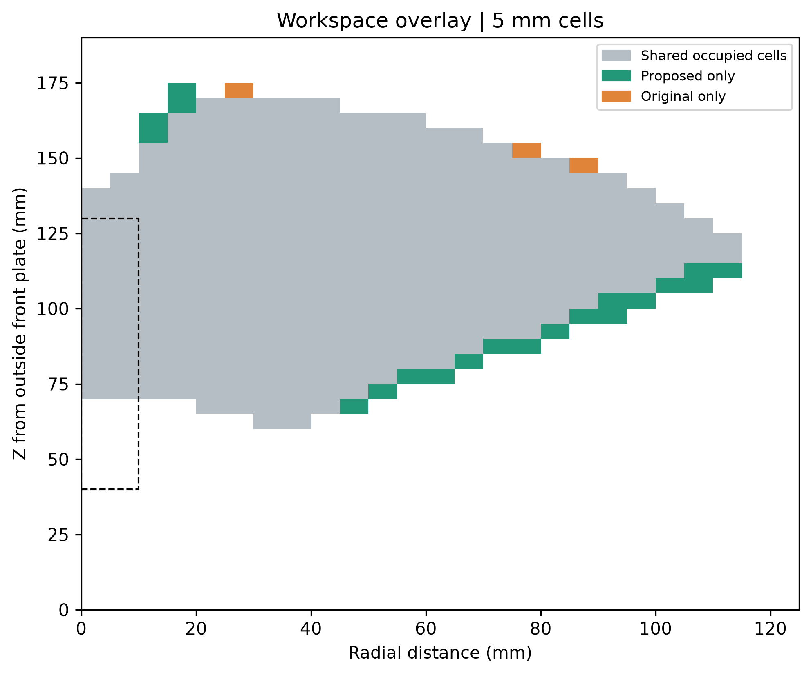

Grey: shared; green: proposed-only; orange: original-only. Gained occupancy is 216.77 cm³ and lost occupancy is 30.24 cm³. The dashed box marks the forward corridor; these are sampled, not exact, set differences.

### Figure 5.7: Median positional isotropy comparison

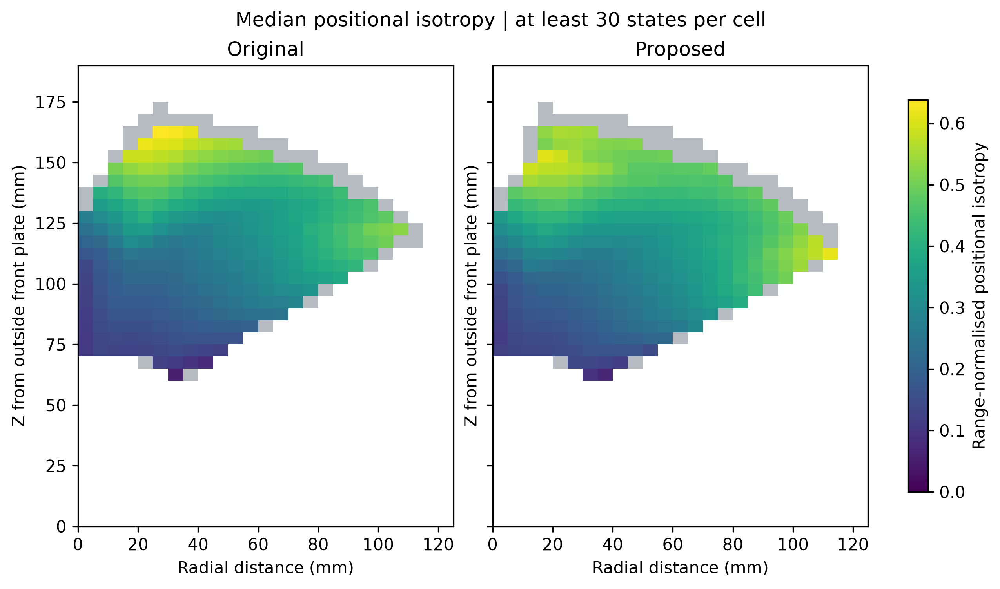

Common colour scale; at least 30 configurations per displayed cell. Grey means insufficient support; white lies outside sampled occupancy.

### Figure 5.8: Change in median positional isotropy

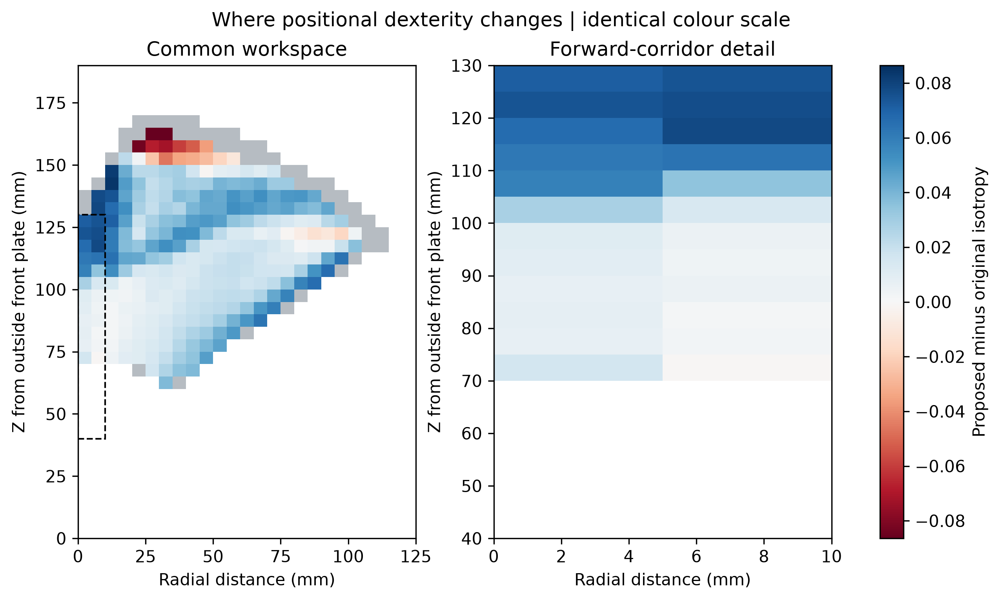

Proposed minus original in common cells with at least 30 states per design. Blue means higher isotropy; red lower. Differences are absolute isotropy units. The corridor enlargement uses the same scale.

### Figure 5.9: Median fixed-start IK residual

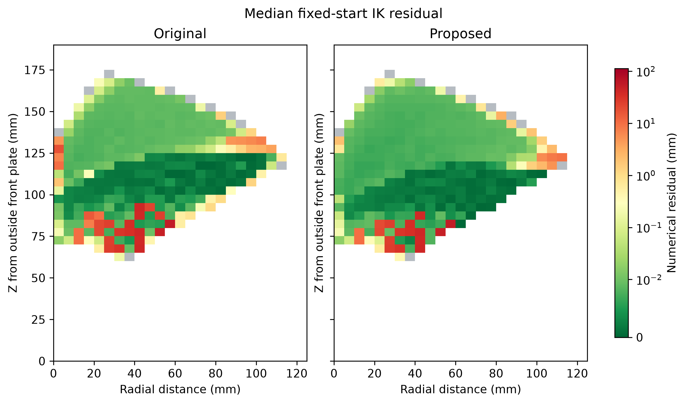

Identical targets, at least 30 per displayed cell. Blue indicates lower and red higher residuals. The scale is linear below 0.01 mm and logarithmic above. Grey means insufficient support.

### Figure 5.10: 95th-percentile fixed-start IK residual

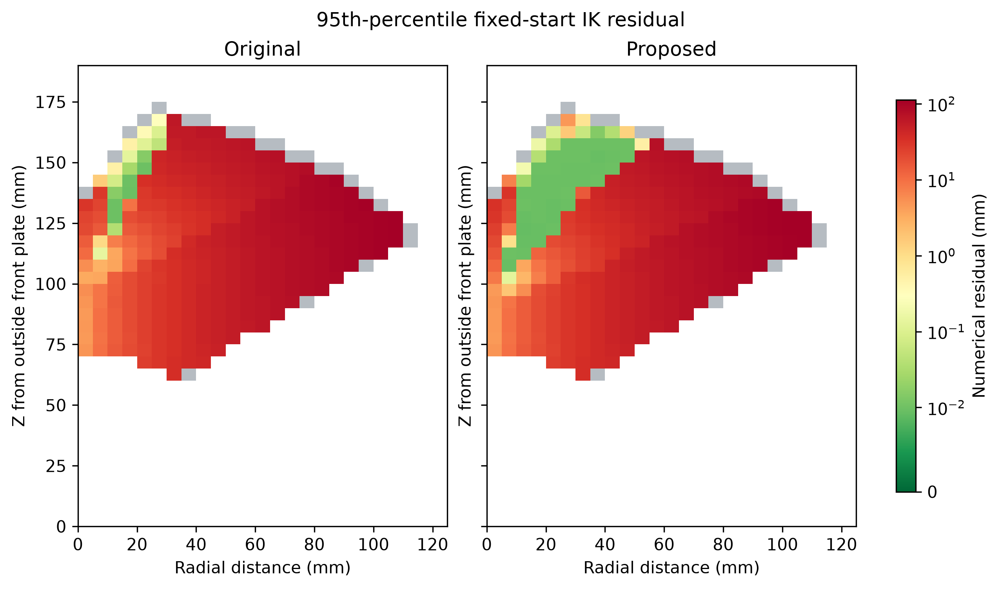

Identical targets, at least 100 per displayed cell. Failed attempts remain included. P95 is neither a maximum nor a confidence bound. Shares the median residual scale.

### Figure 5.11: Fixed-start IK failure fraction

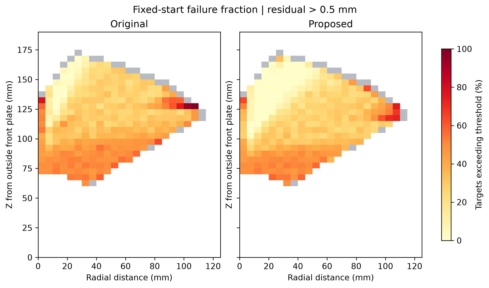

Fraction exceeding 0.5 mm numerical residual; at least 100 targets per displayed cell. Failure describes this solver and initialisation, not proof of geometric unreachability. The original report palette is preserved.

### Figure C.1: Post-hoc trajectory diagnosis using alternative starting configurations

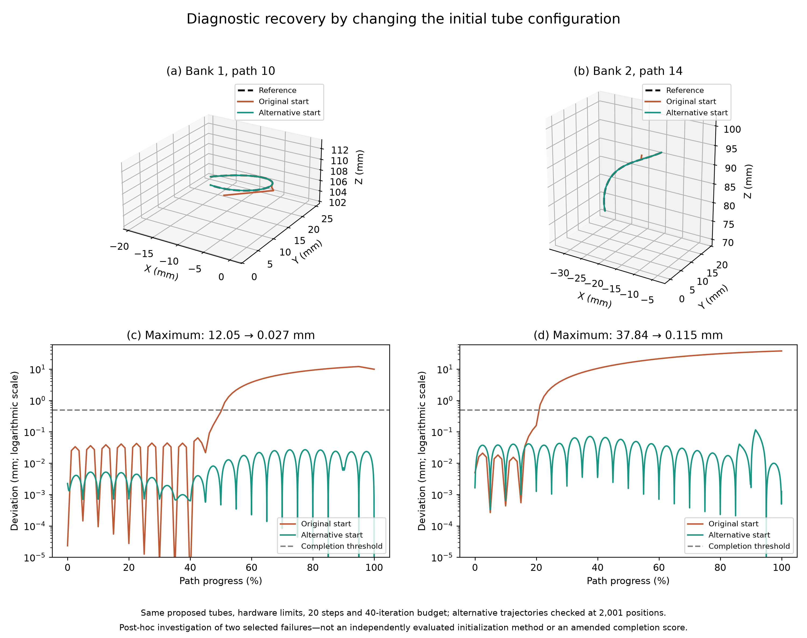

Two investigated proposed-tube failures: maximum deviations 12.05 and 37.84 mm reduced to 0.027 and 0.115 mm at 2,001 checked positions. Geometry, constraints, 20 motion steps and 40-iteration budget are unchanged. These selected cases do not replace the 43/48 score.
